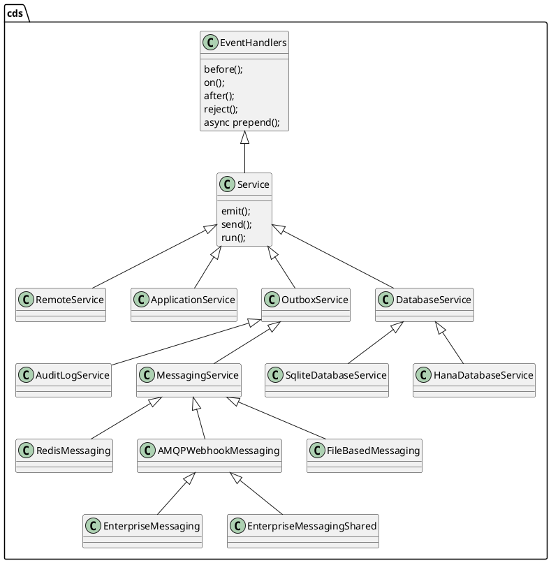

# CAP NodeJS Runtime Arch Overview

## Expert Level Session

Theo Sun
2022

---

## Service Layer

> An overview for the `cds.Service` hierarchy




---

## Service-dispatch

> how the service handle each request


```js
exports.handle = async function handle (req) {
  const srv=this; let handlers //...

  // ._initial handlers run in sequence
  handlers = this._handlers._initial.filter (h => h.for(req))
  if (handlers.length) {
    for (const each of handlers) await each.handler.call (this,req)
    if (req.errors) throw req.errors.throwable()
  }

  // .before handlers run in parallel
  handlers = this._handlers.before.filter (h => h.for(req))
  if (handlers.length) {
    await Promise.all (handlers.map (each => each.handler.call (this,req)))
    if (req.errors) throw req.errors.throwable()
  }

  // .on handlers run in parallel for async events, and as interceptors stack for sync requests
  handlers = this._handlers.on.filter (h => h.for(req))
  if (handlers.length) {
    if (!req.reply) await Promise.all (handlers.map (each => each.handler.call (this,req,_dummy)))
    else await async function next (r=req) { //> handlers may pass a new req object into next()
      const each = handlers.shift(); if (!each) return //> unhandled silently
      const x = await each.handler.call (srv,r,next)
      if (x !== undefined)      return r.reply(x)
      if (r.results)            return r.results
      if (srv._implicit_next)   return next()
    }()
    if (req.errors) throw req.errors.throwable()
  }
  else if (req.query) throw _unhandled (this,req)

  // .after handlers run in parallel
  handlers = this._handlers.after.filter (h => h.for(req))
  if (handlers.length) {
    const results = cds.env.features.arrayed_after && req.event === 'READ' && !_is_array(req.results) ? [req.results] : req.results // REVISIT: remove this in a future release after some grace period
    await Promise.all (handlers.map (each => each.handler.call (this, results, req)))
    if (req.errors) throw req.errors.throwable()
  }

  return req.results //> done
}
```