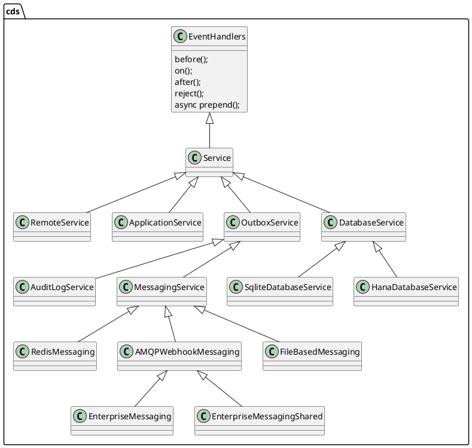

# CAP NodeJS Runtime Arch Overview

## Expert Level Session

Theo Sun
2022

---

## Service Layer

```plantuml
@startuml
class cds.EventHandlers {
  before();
  on();
  after();
  reject();
  async prepend();
}
class cds.Service {}
class cds.RemoteService
class cds.ApplicationService
class cds.OutboxService
class cds.AuditLogService
class cds.MessagingService
class cds.RedisMessaging
class cds.EnterpriseMessaging
class cds.EnterpriseMessagingShared
class cds.AMQPWebhookMessaging
class cds.FileBasedMessaging
class cds.SqliteDatabaseService
class cds.HanaDatabaseService

cds.EventHandlers <|-- cds.Service
cds.Service <|-- cds.ApplicationService
cds.Service <|-- cds.DatabaseService
cds.Service <|-- cds.OutboxService
cds.Service <|-- cds.RemoteService
cds.OutboxService <|-- cds.MessagingService
cds.OutboxService <|-- cds.AuditLogService
cds.MessagingService <|-- cds.RedisMessaging
cds.MessagingService <|-- cds.FileBasedMessaging
cds.MessagingService <|-- cds.AMQPWebhookMessaging
cds.AMQPWebhookMessaging <|-- cds.EnterpriseMessaging
cds.AMQPWebhookMessaging <|-- cds.EnterpriseMessagingShared
cds.DatabaseService <|-- cds.SqliteDatabaseService
cds.DatabaseService <|-- cds.HanaDatabaseService
@enduml
```
