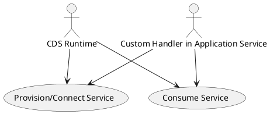
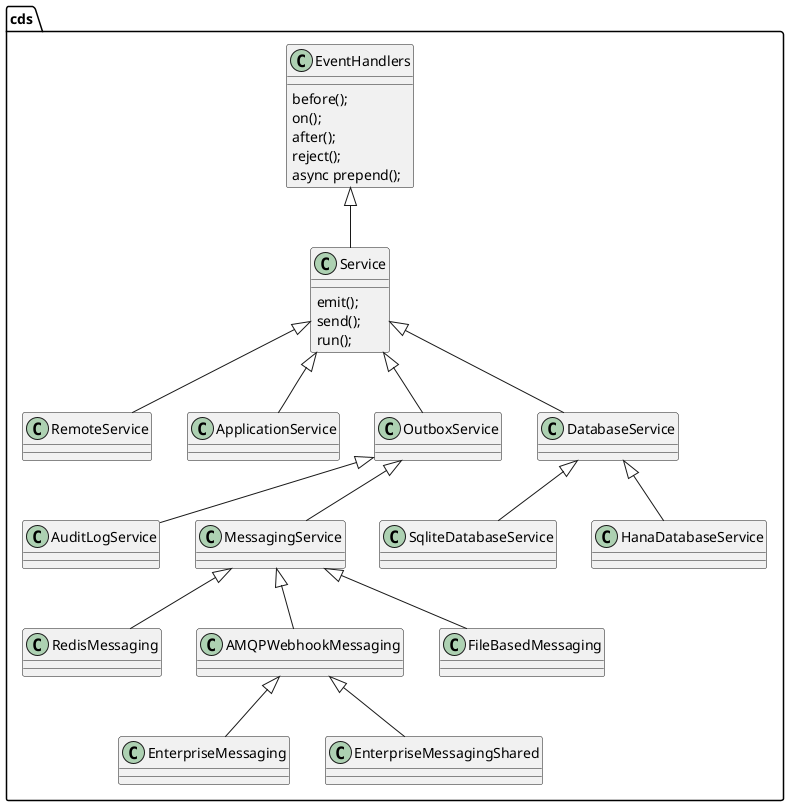

# CAP NodeJS Runtime Service Layer

## Expert Level Session

Theo Sun
2022

---

## Agenda

- introduction the service layer
- `cds.Service` hierarchy in CAP NodeJS Runtime
- provisioning for `cds.Service`
- consuming for `cds.Service`


---

## Service in CAP NodeJS Runtime



---

## Service Layer

> An overview for the `cds.Service` hierarchy



---

## Service kind and impl

- kind - a kind of service
  - db
  - messaging
- impl - an implementation of the kind
  - db
    - sqlite
    - hana
  - messaging
    - file-based
    - enterprise-messaging-shared

> `auth` is not a service


---

## Service Provisioning

- `cds.connect.to`
- `server.js`

---

## Provisioning - connect.to

```js
connect.to = async (datasource, options) => {
  let Service = cds.service.factory, _done = x=>x
  if (typeof datasource === 'object') [options,datasource] = [datasource]
  else if (datasource) {
    if (datasource._is_service_class) [ Service, datasource ] = [ datasource, datasource.name ]
    if (!options) { //> specifying ad-hoc options disallows caching
      if (datasource in cds.services) return cds.services[datasource]
      if (datasource in _pending) return _pending[datasource]
    }
    // queue parallel requests to a single promise, to avoid creating multiple services
    _pending[datasource] = new Promise (r=>_done=r).finally(()=>{ delete _pending[datasource] })
  }
  const o = Service === cds.service.factory ? options4 (datasource, options) : {}
  const m = await model4 (o)
  // check if required service definition exists
  const required = cds.requires[datasource]
  if (required && required.model && datasource !== 'db' && !m.definitions[required.service||datasource]) {
    LOG.error(`No service definition found for '${required.service || datasource}', as required by 'cds.requires.${datasource}':`, required)
    throw new Error (`No service definition found for '${required.service || datasource}'`)
  }
  // construct new service instance
  const srv = new Service (datasource,m,o)
  await srv.prepend (srv.init, srv.options.impl)
  if (datasource === 'db') cds.db = srv
  _done (cds.services[datasource] = srv)
  if (!o.silent) cds.emit ('connect',srv)
  return srv
}
```
---

## Provisioning - bootstrap

> the default `server.js`

```js
module.exports = async function cds_server (options) {

  const _in_prod = process.env.NODE_ENV === 'production'
  const o = cds.options = { ...options, __proto__:defaults }

  const app = cds.app = o.app || express()
  app.serve = _app_serve                          //> app.serve allows delegating to sub modules
  cds.emit ('bootstrap',app)                      //> hook for project-local server.js

  // mount static resources and logger middleware
  if (o.cors)      !_in_prod && app.use (o.cors)        //> CORS
  if (o.static)    app.use (express_static (o.static))  //> defaults to ./app
  if (o.favicon)   app.use ('/favicon.ico', o.favicon)  //> if none in ./app
  if (o.index)     app.get ('/',o.index)                //> if none in ./app
  if (o.correlate) app.use (o.correlate)                //> request correlation
  if (o.logger)    app.use (o.logger)                   //> basic request logging
  if (o.toggler)   app.use (o.toggler)                  //> feature toggler

  // load specified models or all in project
  const csn = await cds.load(o.from||'*',o) .then (cds.minify) //> separate csn for _init_db
  cds.model = cds.compile.for.nodejs(csn)

  // connect to essential framework services if required
  if (cds.requires.extensibility)  await _extensibility() //> has to go first
  if (cds.requires.db)    cds.db = await cds.connect.to ('db') .then (_init)
  if (cds.requires.messaging)      await cds.connect.to ('messaging')
  if (cds.requires.multitenancy)   await _multitenancy()
  if (cds.requires.toggles)        await _model_provider()

  // serve all services declared in models
  if (features.graphql) serve_graphql(app)
  await cds.serve (o.service,o) .in (app)
  await cds.emit ('served', cds.services) //> hook for listeners

  // start http server
  const port = (o.port !== undefined) ? o.port : (process.env.PORT || 4004)
  return app.listen (port)

  // bootstrap in-memory db
  async function _init (db) {
    if (!o.in_memory || cds.requires.multitenancy) return db
    const fts = cds.requires.toggles && cds.resolve (features.folders)
    const m = !fts ? csn : await cds.load([o.from||'*',...fts],o) .then (cds.minify)
    return cds.deploy(m).to(db,o)
  }

}
```

---

## Service Provisioning

- `auth` is not a `cds.Service` but a express middleware
- each service will be singleton (by key) and stored in `cds.services`
- some services are not initialized until they are `cds.connect.to`, for the pre-initialized services, please check the `server.js`
- all the `service` in `cds` definition, (not the `cds.requires`) will be initialized when the server is starting, and they are instances of `cds.ApplicationService`
- suggest to use `kind` in `cds.requires` so that you can switch the `impl` by env

---

## Service Consuming

- srv.emit
- srv.send
- srv.dispatch

> lets start with a batch request

---


---


---

## Service-dispatch

> what happened when we emit a service event?

```js
exports.handle = async function handle (req) {
  const srv=this; let handlers //...

  // ._initial handlers run in sequence
  handlers = this._handlers._initial.filter (h => h.for(req))
  if (handlers.length) {
    for (const each of handlers) await each.handler.call (this,req)
    if (req.errors) throw req.errors.throwable()
  }

  // .before handlers run in parallel
  handlers = this._handlers.before.filter (h => h.for(req))
  if (handlers.length) {
    await Promise.all (handlers.map (each => each.handler.call (this,req)))
    if (req.errors) throw req.errors.throwable()
  }

  // .on handlers run in parallel for async events, and as interceptors stack for sync requests
  handlers = this._handlers.on.filter (h => h.for(req))
  if (handlers.length) {
    if (!req.reply) await Promise.all (handlers.map (each => each.handler.call (this,req,_empty_next)))
    else await async function next (r=req) { //> handlers may pass a new req object into next()
      const each = handlers.shift(); if (!each) return //> unhandled silently
      const x = await each.handler.call (srv,r,next)
      if (x !== undefined)      return r.reply(x)
      if (r.results)            return r.results
      if (srv._implicit_next)   return next()
    }()
    if (req.errors) throw req.errors.throwable()
  }
  else if (req.query) throw _unhandled (this,req)

  // .after handlers run in parallel
  handlers = this._handlers.after.filter (h => h.for(req))
  if (handlers.length) {
    const results = cds.env.features.arrayed_after && req.event === 'READ' && !_is_array(req.results) ? [req.results] : req.results // REVISIT: remove this in a future release after some grace period
    await Promise.all (handlers.map (each => each.handler.call (this, results, req)))
    if (req.errors) throw req.errors.throwable()
  }

  return req.results //> done
}
```

---

## Service-dispatch

- `cds.Service` handle events cascaded
  - `cds.ApplicationService` will trigger `cds.DatabaseService` to execute database operation
- `transaction` is lazier than you expected
- `commit` is later than you expected
- `on` hook have some standard handlers
- `after` hook will trigger rollback if any error occurs

---

## Service-dispatch

- error check is in `hook` level
  - if you do not throw error in `before` hook, the handlers of `on` hook will be executed
  - with `req.error`/`req.reject` API 
    - after `ALL` handlers have been executed in single `hook`, the framework will check and throw the error
  - with `throw` keyword, you can block the synchronous execution of the rest of the handlers in the same `hook`

---

## Service-dispatch

- for `before`/`after` hooks
  - for async handler, the execution order is not promised, they are executed in parallel
  - for sync handler, the execution order is related to the registered order
- for `on` hook
  - for `cds.Request`, the execution order is related to the registered order
    - you can use `await next()` to do something like `@Around` in Spring 
  - for `cds.Event`, the execution order is not promised, in parallel

---

## cds.ApplicationService and adapter

- odata
- rest (changing)
- graphql (experimental)

---

## Batch Operation for OData Adapter

- `READ` operations are parallel
- `WRITE` operations in each `changeset` will be sequential
- each `changeset` will have its own database transaction

---

# Thank You

Theo Sun
2022