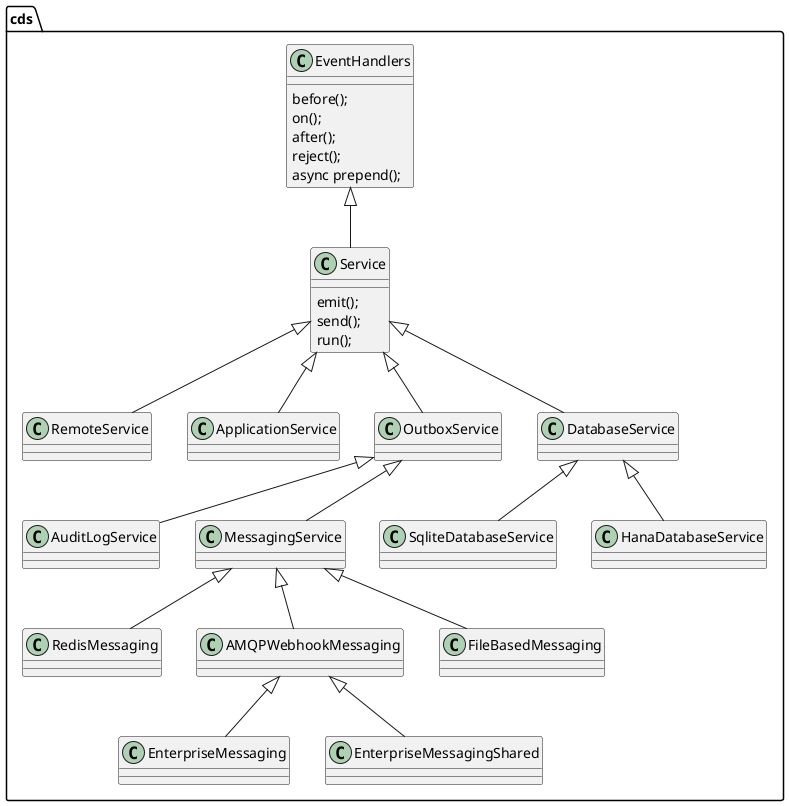

# CAP NodeJS Runtime Service Layer

## Expert Level Session

Theo Sun
2022

---

## Service Layer

> An overview for the `cds.Service` hierarchy




---

## Service-dispatch

> how the service handle each request

```js
exports.handle = async function handle (req) {
  const srv=this; let handlers //...

  // ._initial handlers run in sequence
  handlers = this._handlers._initial.filter (h => h.for(req))
  if (handlers.length) {
    for (const each of handlers) await each.handler.call (this,req)
    if (req.errors) throw req.errors.throwable()
  }

  // .before handlers run in parallel
  handlers = this._handlers.before.filter (h => h.for(req))
  if (handlers.length) {
    await Promise.all (handlers.map (each => each.handler.call (this,req)))
    if (req.errors) throw req.errors.throwable()
  }

  // .on handlers run in parallel for async events, and as interceptors stack for sync requests
  handlers = this._handlers.on.filter (h => h.for(req))
  if (handlers.length) {
    if (!req.reply) await Promise.all (handlers.map (each => each.handler.call (this,req,_dummy)))
    else await async function next (r=req) { //> handlers may pass a new req object into next()
      const each = handlers.shift(); if (!each) return //> unhandled silently
      const x = await each.handler.call (srv,r,next)
      if (x !== undefined)      return r.reply(x)
      if (r.results)            return r.results
      if (srv._implicit_next)   return next()
    }()
    if (req.errors) throw req.errors.throwable()
  }
  else if (req.query) throw _unhandled (this,req)

  // .after handlers run in parallel
  handlers = this._handlers.after.filter (h => h.for(req))
  if (handlers.length) {
    const results = cds.env.features.arrayed_after && req.event === 'READ' && !_is_array(req.results) ? [req.results] : req.results // REVISIT: remove this in a future release after some grace period
    await Promise.all (handlers.map (each => each.handler.call (this, results, req)))
    if (req.errors) throw req.errors.throwable()
  }

  return req.results //> done
}
```

---


---


---

## Service-dispatch

- `cds.Service` handle events cascaded
  - `cds.ApplicationService` will trigger `cds.DatabaseService` to execute database operation
- `transaction` is lazier than you expected
- `commit` is later than you expected
- `on` hook have some standard handlers
- `after` hook will trigger rollback if any error occurs

---

## Service-dispatch

- error check is in `hook` level
  - if you do not throw error in `before` hook, the handlers of `on` hook will be executed
  - with `req.error`/`req.reject` API 
    - after `ALL` handlers have been executed in single `hook`, the framework will check and throw the error
  - with `throw` keyword, you can block the synchronous execution of the rest of the handlers in the same `hook`

---

## Service-dispatch

- for `before`/`after` hooks
  - for async handler, the execution order is not promised, they are executed in parallel
  - for sync handler, the execution order is related to the registered order
- for `on` hook
  - for `cds.Request`, the execution order is related to the registered order
    - you can use `await next()` to do something like `@Around` in Spring 
  - for `cds.Event`, the execution order is not promised, in parallel


---

## Service kind and impl

- kind - a kind of service
  - db
  - messaging
- impl - an implementation of the kind
  - db
    - sqlite
    - hana
  - messaging
    - file-based
    - enterprise-messaging-shared

> `auth` is not a service

---

## Service kind and impl

- `auth` is not a `cds.Service` but a express middleware
- each service will be singleton (by key) and stored in `cds.services`
- some services are not initialized until they are `cds.connect.to`, for the pre-initialized services, please check the `server.js`
- all the `service` in `cds` definition, will be initialized when the server is starting, and they are instances of `cds.ApplicationService` 
- suggest to use `kind` in `cds.requires` so that you can switch the `impl` by env

---

## cds.ApplicationService and adapter

- odata
- rest (changing)
- graphql (experimental)

---

## Batch Operation for OData Adapter

- `READ` operations are parallel
- `WRITE` operations in each `changeset` will be sequential
- each `changeset` will have its own database transaction

---

# Thank You

Theo Sun
2022