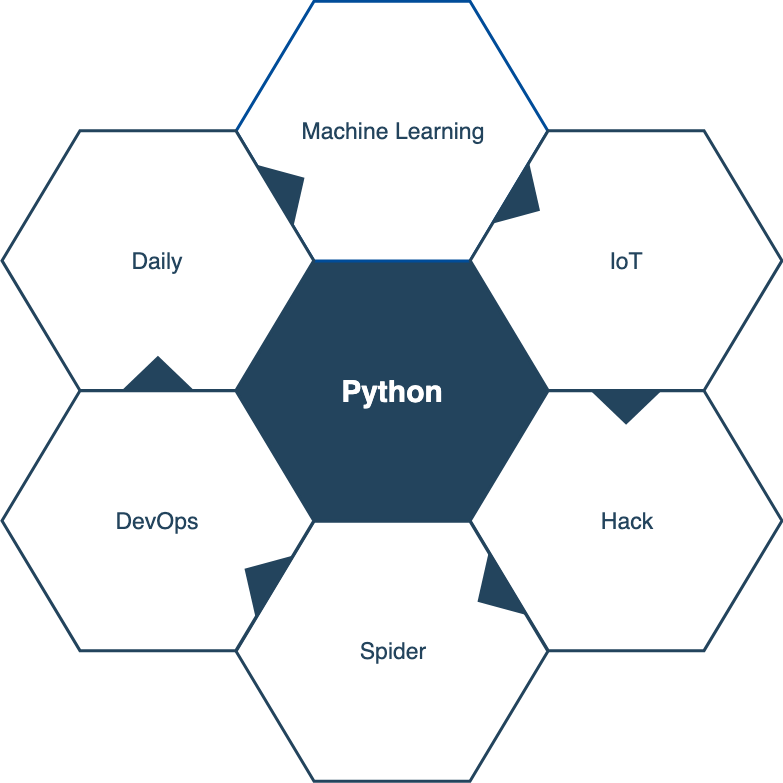

# Introduction for python

<br>

Theo Sun
2019

---

## Keywords

<br>

* Since 1991
* Programming paradigm: OOP, FOP
* Weak type script language
* Easy to learn & use

---

## Concepts

<br>

* CPython & IronPython & Jython
* Cython
* Python 2 & Python 3
* BDFL - Benevolent Dictator For Life
* PEP - Python Enhancement Proposal

---

## Global Interpreter Lock

<br>

> In CPython, the global interpreter lock, or GIL, is a mutex that protects access to Python objects, preventing multiple threads from executing Python bytecodes at once. This lock is necessary mainly because CPython's memory management is not thread-safe. (However, since the GIL exists, other features have grown to depend on the guarantees that it enforces.)

<br>


<br>

So that `multiprocessing` is used in python web framework.

---

## IDEs

<br>

* VSCode with extension
* Sublime
* PyCharm (Community)

---

## Libraries

<br>

* [Numpy](https://www.numpy.org) Statistics & Machine Learning
* [Micro Python](https://micropython.org) Internet of Things
* [Scrapy](https://scrapy.org/) Internet spider
* [Flask](https://github.com/pallets/flask) Web
* [Tushare](http://tushare.org) Financial

---

## Quick view with a flask application

<br>

```python
# modules
from flask import Flask, escape, request

# runtime define
app = Flask(__name__)

@app.route('/')
def hello(): # no param type & return type
    # indented block
    name = request.args.get("name", "World")
    return f'Hello, {escape(name)}!'
```

---

## Quick view with a simple KNN algorithm

<br>

```python
import numpy as np
import matplotlib.pyplot as plt
from sklearn import neighbors

np.random.seed(0)
X = np.sort(5 * np.random.rand(40, 1), axis=0)
T = np.linspace(0, 5, 500)[:, np.newaxis]
y = np.sin(X).ravel()
y[::5] += 1 * (0.5 - np.random.rand(8))

for i, weights in enumerate(['uniform', 'distance']):
    knn = neighbors.KNeighborsRegressor(n_neighbors, weights=weights)
    y_ = knn.fit(X, y).predict(T)

    plt.subplot(2, 1, i + 1)
    plt.scatter(X, y, c='k', label='data')
    plt.plot(T, y_, c='g', label='prediction')
    plt.axis('tight')
    plt.legend()
    plt.title("KNeighborsRegressor (k = %i, weights = '%s')" % (n_neighbors,
                                                                weights))

plt.tight_layout()
plt.show()
```


---

## Quick view with a micropython IoT device

<br>


```python
from mpython import *

while True:
    oled.fill(0)                                   #清屏
    oled.DispChar("亮度:",30,16)                    #显示亮度
    oled.DispChar("%d" % (light.read()), 60, 16)    #显示板载光线传感器
    oled.show()                                     #刷新
    sleep_ms(100)                                   #延时100ms

    if light.read() < 200 :                    # 当光线小于200，灯亮
        rgb.fill((50,50,50))
        rgb.write()
    else:                                      # 否则，灯灭
        rgb.fill((0,0,0))
        rgb.write()
```

---


## Summary: why or why not ?

---

## Choose python

<br>

If you want:

<br>



---

## DONT choose python

<br>

If you want:

<br>

* Impl high performance core business service
* Create meaningful UI
