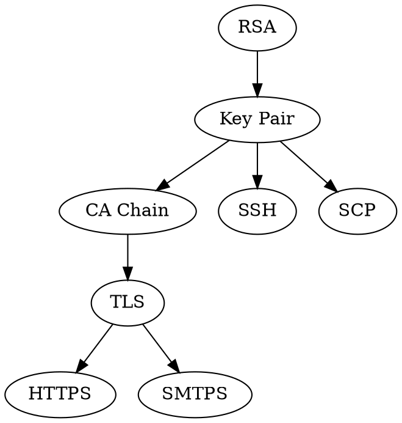
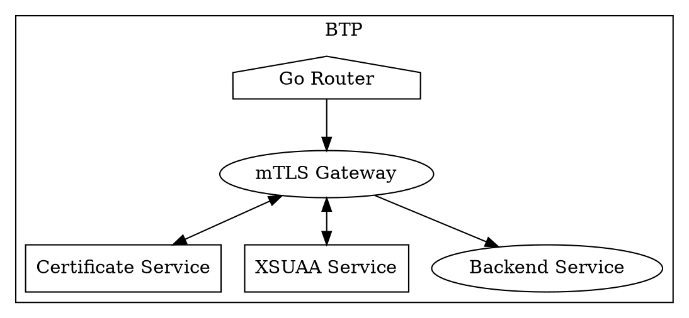

# mTLS E2E Introduction

Theo Sun
2022

---



---



---

## RSA

> RSA (Rivest–Shamir–Adleman) is a public-key cryptosystem that is widely used for secure data transmission.

$encrypted=plain^E\mathrm{mod}N$
$plain=encrypted^D\mathrm{mod}N$

[Proofs](https://en.wikipedia.org/wiki/RSA_(cryptosystem)#Proofs_of_correctness)

---

## Choose the `E` and `D` number

```go
func NewKeyPair(n int64) (p *KeyPair) {
  p = &KeyPair{}
  p.P = NewPrime(n)
  p.Q = NewPrime(n)
  for {
    p.E = NewPrime(p.L.Int64())
    if big.NewInt(0).GCD(nil, nil, p.L, p.E).Cmp(big.NewInt(1)) == 0 {
      break
    }
  }
  p.D = big.NewInt(int64(1))
  for {
    p.D = p.D.Add(p.D, big.NewInt(1))
    if p.D.ModInverse(p.E, p.L) != nil || p.D.Cmp(p.L) > 0 {
      break
    }
  }
  p.N = big.NewInt(1).Mul(p.P, p.Q)
  return
}
```


---

## if we switch the `D` number and `E` number

```go
func TestEncryptDecryptMagic(t *testing.T) {
	assert := assert.New(t)
	p := NewKeyPair(1000)
	p.D, p.E = p.E, p.D // swap the encryption & decryption number
	encrypted := p.Encrypt([]byte("hello rsa"))
	decrypted := p.Decrypt(encrypted)
	assert.EqualValues("hello rsa", decrypted)
}
```

---

## Reference

- [RSA加密算法原理](https://blog.csdn.net/a745233700/article/details/102341542)
- [费马小定理——从素数判定到RSA公钥加密体制](https://blog.csdn.net/wang_yi_wen/article/details/8954079)