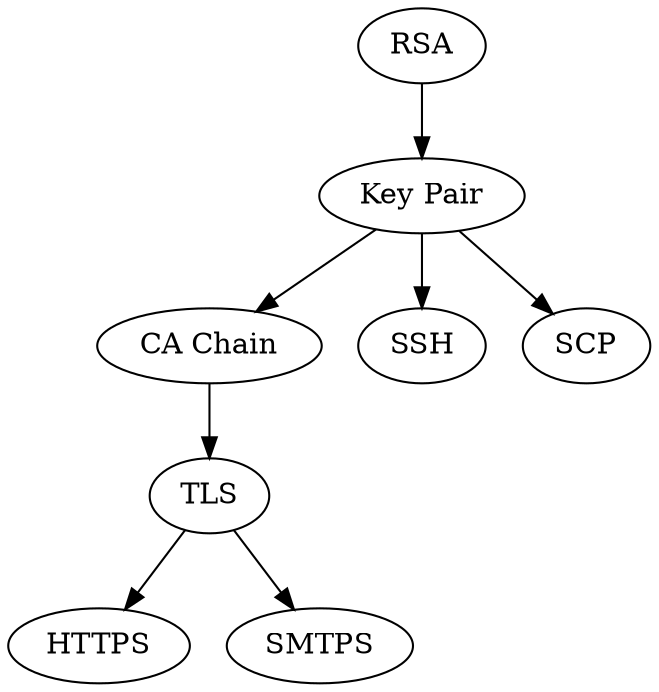
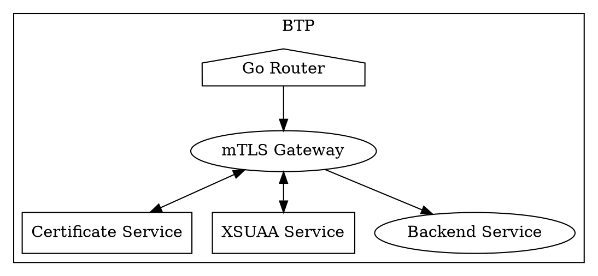

# mTLS E2E Introduction

Theo Sun
2022

---

```graphviz
digraph G  {
  kp [label="Key Pair"];
  
	RSA -> kp;
  kp -> {"CA Chain" SSH SCP};
  "CA Chain" -> {TLS};
  TLS -> {HTTPS SMTPS};
}
```

---

```graphviz
digraph G {

  subgraph cluster_btp {
    
    label = "BTP";
    cs [label="Certificate Service" shape="box"];
    uaa [label="XSUAA Service" shape="box"];
    go_router [label="Go Router" shape="house"];
    mtls_gateway [label = "mTLS Gateway"];
    backend_service [label="Backend Service"]

    go_router -> mtls_gateway
    mtls_gateway -> uaa [dir=both]
    mtls_gateway -> cs [dir=both]
    mtls_gateway -> backend_service

  }

}
```