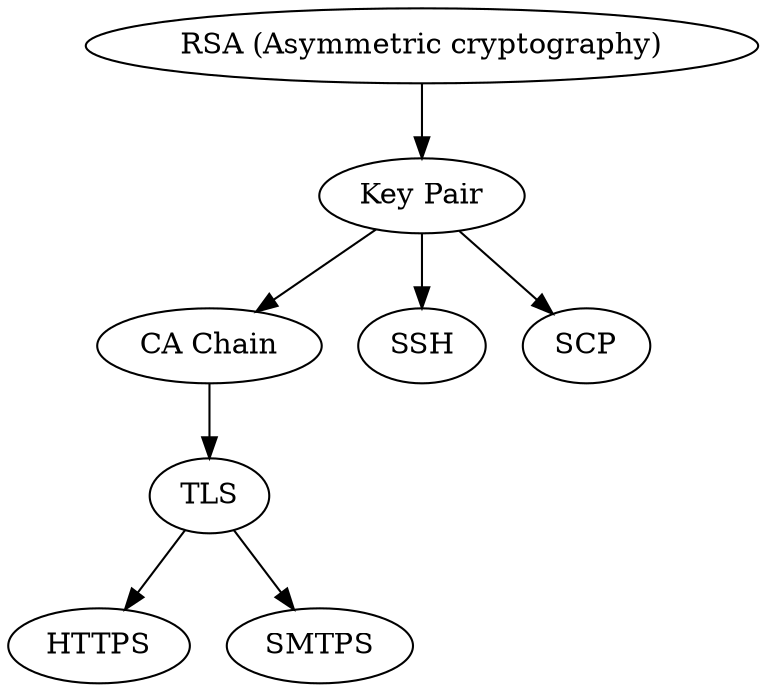

# mTLS E2E Introduction

Theo Sun
2022


---

## Agenda

- mTLS authentication
- RSA
- Certificate Chain
- mTLS on XSUAA
- mTLS for Cloud Foundry

---

## What is mutual authentication?

> `Mutual authentication` or `two-way authentication` (not to be confused with `two-factor authentication`) refers to two parties authenticating each other at the same time in an authentication protocol. It is a default mode of authentication in some protocols (IKE, SSH) and optional in others (TLS).

---

## What is mutual TLS (mTLS)?

> `By default` the TLS protocol only proves the identity of the server to the client using X.509 certificates, and the authentication of the client to the server is left to the application layer. TLS also offers client-to-server authentication using `client-side X.509 authentication`. As it requires provisioning of the certificates to the clients and involves less user-friendly experience, it's rarely used in end-user applications.

---

## Use Cases?

- [System Integration](https://blogs.sap.com/2020/02/24/client-certificate-based-authentication-in-sap-cpi/)
- [Business Application Logon](https://help.sap.com/doc/f6aa88606e0d42b4a5f1edf9272548f8/2102/en-US/Security_Guide.pdf)
- [Service Mesh Network - Istio](https://istio.io/latest/docs/concepts/security/)

---

## Why?

> Okay, its nice, but why we use that?

- save you from transport layer attacks
  - MIIM
- make authentication simple (application can leave authentication to transport laver)
- product standards

---

## How it works?

> The path of `TLS`/`HTTPS`




---

## RSA

> RSA (Rivest–Shamir–Adleman) is a public-key cryptosystem that is widely used for secure data transmission.

$encrypted=plain^E\mathrm{mod}N$
$plain=encrypted^D\mathrm{mod}N$

[Alg Example](https://en.wikipedia.org/wiki/RSA_(cryptosystem)#Example)
[Proofs](https://en.wikipedia.org/wiki/RSA_(cryptosystem)#Proofs_of_correctness)

---

## How to find a prime number

```go
// NewPrime with range, if n <= 1, will create a real random prime
func NewPrime(n int64) *big.Int {
	// set seed for each value
	rand.Seed(time.Now().UnixNano())
	var newRandValue func() int64
	if n <= 1 {
		newRandValue = func() int64 {
			return int64(rand.Int())
		}
	} else {
		newRandValue = func() int64 {
			return int64(rand.Intn(int(n)))
		}
	}
	for {
		v := big.NewInt(int64(newRandValue()))
		// ref: https://en.wikipedia.org/wiki/Miller%E2%80%93Rabin_primality_test
		if v.ProbablyPrime(10) {
			return v
		}
	}
}
```

* **random** is important for crypto

---

## Choose the `E` and `D` number

```go
// NewKeyPair with parameter, put '0' as automatically long int key
func NewKeyPair(n int64) (p *KeyPair) {
	p = &KeyPair{}
	p.P = NewPrime(n)
	for {
		// not same
		p.Q = NewPrime(n)
		if p.Q.Cmp(p.P) != 0 {
			break
		}
	}
	pqValue := big.NewInt(1).Mul(
		big.NewInt(0).Sub(p.P, big.NewInt(1)),
		big.NewInt(0).Sub(p.Q, big.NewInt(1)),
	)
	pqGCD := big.NewInt(0).GCD(
		nil, 
		nil,
		big.NewInt(0).Sub(p.P, big.NewInt(1)), 
		big.NewInt(0).Sub(p.Q, big.NewInt(1)),
	)

	p.L = pqValue.Div(pqValue, pqGCD)

	for {
		p.E = NewPrime(p.L.Int64())
		if big.NewInt(0).GCD(nil, nil, p.L, p.E).Cmp(big.NewInt(1)) == 0 {
			break
		}
	}

	p.D = big.NewInt(int64(1))

	for {
		p.D = p.D.Add(p.D, big.NewInt(1))
		if p.D.ModInverse(p.E, p.L) != nil || p.D.Cmp(p.L) > 0 {
			break
		}
	}

	p.N = big.NewInt(1).Mul(p.P, p.Q)
	return
}
```

[Wiki Example](https://en.wikipedia.org/wiki/RSA_(cryptosystem)#Example)

---

## So ?

- Encryption
  - public use $public(N, E)$ to `encrypt` plain data
  - private use $private(N, D)$ to `decrypt` the encrypted message.
- Signature
  - private use $private(N, D)$ to `sign` (`encrypt` the `hash` of data and attach it to the message) the data 
  - public use $public(N, E)$ to `verify` (`decrypt` the `hash` attached in message and compare it with locally computed `hash` result)


---

## if we switch the `D` number and `E` number

```go
func TestEncryptDecryptMagic(t *testing.T) {
	assert := assert.New(t)
	p := NewKeyPair(1000)
	p.D, p.E = p.E, p.D // swap the encryption & decryption number
	encrypted := p.Encrypt([]byte("hello rsa"))
	decrypted := p.Decrypt(encrypted)
	assert.EqualValues("hello rsa", decrypted)
}
```

[Interesting ? Go to code](https://github.dev/Soontao/rsa-interactive-session)

---

## CA and Trust Chain

---


---

## NginX Configuration

> for client certification


```conf
server {
    listen        443;
    ssl on;
    server_name myserver.com;
    proxy_ssl_server_name on;
    ssl_certificate      /etc/nginx/certificates/cert.crt; ## Use your own trusted certificate from CA/SSLTrust
    ssl_certificate_key /etc/nginx/certificates/cert.key; ## Use your own trusted certificate from CA/SSLTrust
    ssl_client_certificate /etc/nginx/certificates/myCA.pem; ## Use your own trusted certificate from CA/SSLTrust
    ssl_verify_client on;
    ssl_prefer_server_ciphers on;
    ssl_protocols TLSv1.1 TLSv1.2;
    ssl_ciphers 'ignored';
    keepalive_timeout 10;
    ssl_session_timeout 5m;

location / {
    proxy_set_header X-Forwarded-For $proxy_add_x_forwarded_for;
    proxy_set_header Host $http_host;
    proxy_redirect off;
    proxy_set_header X-Forwarded-Proto https;
    proxy_pass http://mysite;
    // optionally you may want to look into the proxy_pass_reverse directive as well.
  }
}
```

---

## Typical Client Authentication Flow


---


## Cloud Foundry Solution


```plantuml
header mTLS on Cloud Foundry

"TLS Client" -> HAProxy: X.509 Certificate
HAProxy -> "CF Go Router"
"CF Go Router" -> "Custom Application"
```


- [XSUAA Documentation](https://github.wdf.sap.corp/CPSecurity/xsuaa/blob/master/architecture/authentication/api/X.509.MD#solution-outline-for-certificate-forwarding)
- [EMS Documentation](https://wiki.wdf.sap.corp/wiki/pages/viewpage.action?pageId=2585948865)

---

## [Pure mTLS Authentication on CF without XSUAA](https://github.tools.sap/I337313/mtls-example)

---

## But ... How about `Outbound` communication?

- for `java` get keystore from `destination service` and set it into [`HttpClient`](https://www.javadoc.io/doc/org.apache.httpcomponents/httpclient/4.5.9/org/apache/http/impl/client/HttpClientBuilder.html#setSslcontext(javax.net.ssl.SSLContext))
- for `nodejs` just use the raw `PEM` format cert/key and put it into [`http.Agent`](https://nodejs.org/api/tls.html#tlscreatesecurecontextoptions)

---

## Reference

- [TLS Wiki](https://en.wikipedia.org/wiki/Transport_Layer_Security)
- [RSA Interactive Session](https://github.com/Soontao/rsa-interactive-session)
- [Public Keys, Private Keys, and Certificates](https://docs.oracle.com/cd/E19509-01/820-3503/ggbgc/index.html)
- [RSA加密算法原理](https://blog.csdn.net/a745233700/article/details/102341542)
- [费马小定理——从素数判定到RSA公钥加密体制](https://blog.csdn.net/wang_yi_wen/article/details/8954079)
- [Wiki Example](https://en.wikipedia.org/wiki/RSA_(cryptosystem)#Example)